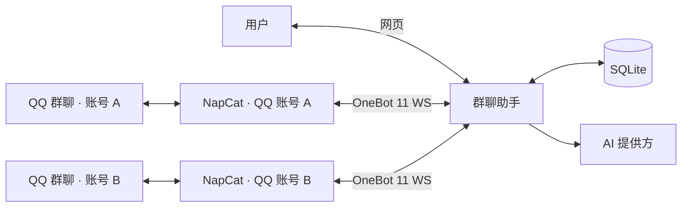
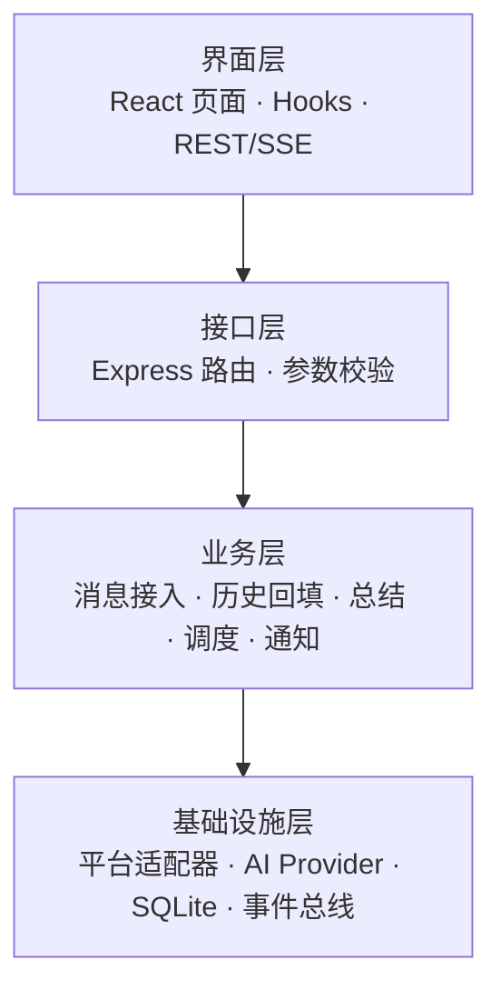
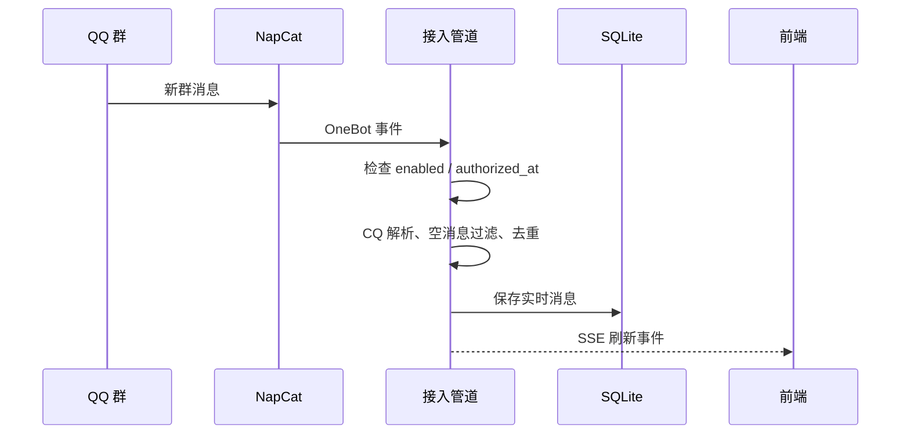
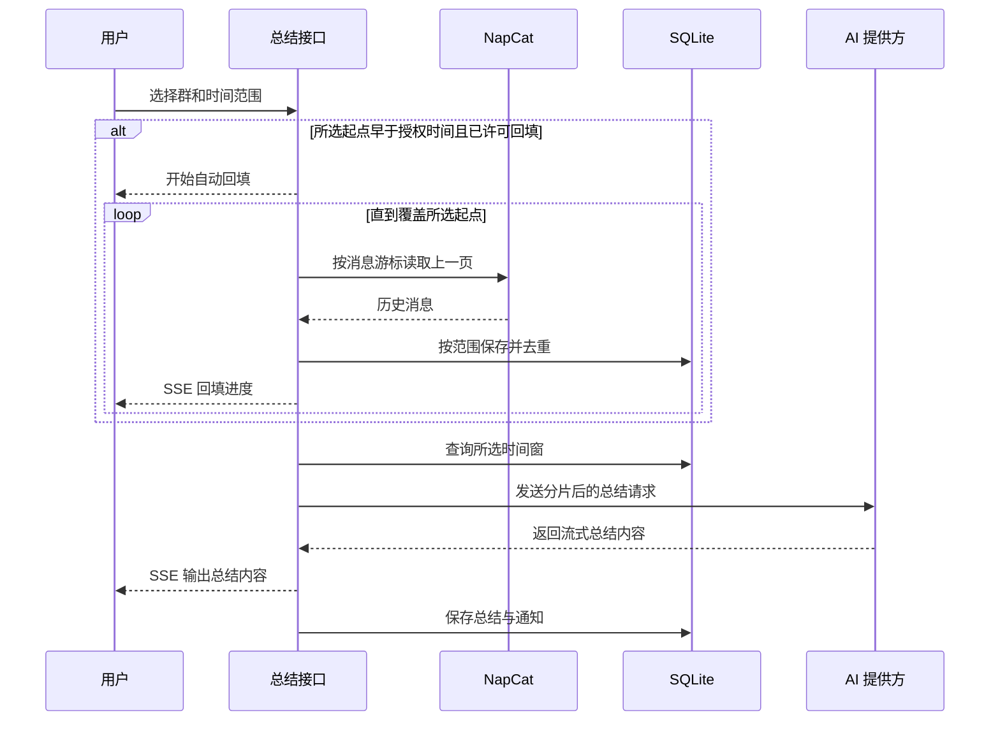
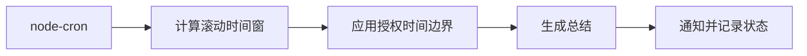

# 架构设计（DESIGN）

> 群聊数据 + AI 总结 Agent Web 应用
> 技术底座：CodeBuddy Agent SDK + 官方 skill `codebuddy-chat-web` 模板（React + Vite + TDesign / Express + SSE / SQLite）

---

## 1. 一句话定位

一个**可插拔多平台**的群聊消息采集与 **AI 自动总结** 应用。当前主攻 QQ（OneBot 11 协议），
通过统一的 `PlatformAdapter` 抽象，后续可平滑接入飞书 / 微信 / Telegram / Discord 等。

## 2. 总体架构

项目采用本地部署的单体全栈架构：React 前端通过 REST 和 SSE 访问 Express 后端；后端同时承载
Agent 对话和群聊总结两个业务域，以 SQLite 持久化数据，通过适配器连接外部消息平台。

### 2.1 系统边界



边界图只表达系统之间的关系：NapCat 负责登录 QQ 和提供 OneBot 接口；群聊助手负责授权、采集、
回填、总结及通知；AI 提供方只接收用户要求总结的时间窗内容。

### 2.2 应用内部分层



两个业务域共用同一个 Express 进程和 SQLite 数据库，但数据表与核心流程相互隔离：

- **Agent 对话域**：会话、模型、工具调用与权限确认。
- **群聊总结域**：群授权、实时消息、历史回填、AI 总结、计划任务与通知。

### 2.3 运行时边界

| 进程/容器 | 默认端口 | 职责 |
|---|---:|---|
| Vite 开发服务器 | 5173 | 前端页面，并将 `/api` 代理到 Express |
| Express API | 3000 | REST、SSE、总结任务、调度器和数据库访问；可由 `PORT` 覆盖 |
| OneBot 反向 WS | 3001 | 同时接收多个 NapCat 账号连接，并向指定账号连接下发 OneBot 动作 |
| NapCat WebUI | 6099 | QQ 登录和 OneBot 网络配置 |

当前本地环境把 Express 的 `PORT` 配置为 `3010`，Vite 会按配置代理，不改变整体架构。

## 3. 模块职责

| 模块 | 文件 | 职责 |
|---|---|---|
| 配置 | `server/config.ts` | 集中管理端口、适配器、OneBot、总结、SMTP、节流等配置 |
| 事件总线 | `server/eventBus.ts` | 进程内发布订阅，把消息/总结/提醒/状态广播给 SSE |
| 平台适配 | `server/adapters/` | `types.ts` 统一接口；`onebot11.ts` QQ；`index.ts` 工厂 |
| 数据处理 | `server/ingest/` | `cqcode.ts` CQ 码解析；`pipeline.ts` 授权过滤/去重/入库；`history.ts` 按游标分页回填 |
| 总结引擎 | `server/summary/` | 提示词、分片与 map-reduce；支持 CodeBuddy、OpenAI 兼容接口及 Ollama |
| 通知分发 | `server/notify/` | `dispatcher.ts` 站内通知 + 即时提醒节流；`email.ts` SMTP 邮件 |
| 调度 | `server/scheduler.ts` | node-cron 加载计划、并发控制，并强制遵守群授权时间边界 |
| 路由 | `server/routes/` | groups / messages / summaries / notifications / priorities / schedules / settings / events / dashboard |
| 数据库 | `server/db.ts` | 模板 `sessions`/`messages` + 群聊域 10 张表与全部数据访问函数 |

## 4. 数据库表

模板原有（**保留不动**，仅供 Agent 对话）：`sessions`、`messages`。

群聊域新增：

| 表 | 说明 | 关键约束 |
|---|---|---|
| `global_settings` | 全局设置（key-value JSON） | PK `key` |
| `platform_accounts` | 平台账号（一个实例一条） | — |
| `groups` | 群 | `UNIQUE(platform_account_id, platform_group_id)` |
| `group_configs` | 群配置：是否读取、优先级、是否参与总结/推送 | PK `group_id` → `groups` |
| `group_messages` | 群原始消息（CQ 解析后） | `UNIQUE(group_id, platform_message_id)`；索引 `(group_id, timestamp)` |
| `summaries` | AI 总结 | 索引 `(group_id, created_at)` |
| `priority_rules` | 优先级规则 | — |
| `schedules` | 定时计划 | cron + timezone |
| `notifications` | 通知（总结/即时提醒/系统） | 索引 `(read, created_at)` |
| `push_logs` | 推送日志（通道级） | → `notifications` |

> 命名刻意使用 `group_messages` 而非 `messages`，避免与模板 Agent 对话消息表冲突。

## 5. 平台适配器抽象

```ts
interface PlatformAdapter {
  readonly platform: string;                    // 'qq' | 'wechat' | 'telegram' | ...
  init(): Promise<void>;
  start(): Promise<void>;
  stop(): Promise<void>;
  getStatus(): AdapterStatus;                   // offline|connecting|connected|error
  getSelfId(): string;
  getAccounts(): PlatformAccountConnection[];
  getGroups(accountSelfId?: string): Promise<UnifiedGroup[]>;
  getGroupMembers?(groupId: string): Promise<UnifiedMember[]>;
  getGroupHistory?(
    groupId: string,
    options: { count: number; beforeMessageId?: string },
    accountSelfId?: string
  ): Promise<UnifiedMessage[]>;
  sendGroupMessage(groupId: string, text: string, accountSelfId?: string): Promise<{ messageId: string }>;
  onMessage(handler: (msg: UnifiedMessage) => void): void;
  onStatusChange?(handler: (s: AdapterStatus, info?: string) => void): void;
  onAccountStatusChange?(handler: (account: PlatformAccountConnection) => void): void;
}
```

- **OneBot 11**：反向 WS 服务端（默认端口 3001），握手校验 `Authorization: Bearer <token>`；
  同一端口允许多个 NapCat 客户端接入，以 `self_id` 建立账号到 Socket 的映射；`message/group` 事件映射为带账号标识的 `UnifiedMessage`；
  动作（`send_group_msg` / `get_group_list` / `get_group_msg_history`）只下发到目标群所属账号的 WS，并以 `echo` 匹配响应。
  历史回填使用 OneBot 消息 ID 作为游标逐页向前读取，数据库唯一键保证任务可安全重试。

## 6. 核心数据流

### 6.1 授权后的实时消息



实时事件只有在群已启用且消息时间不早于最近授权时间时才能入库。历史回填使用独立来源标记，
只补充总结数据，不广播为实时新消息，也不触发已经过期的即时提醒。

### 6.2 手动总结与自动历史回填



滚动时间窗默认开启历史回填许可，用户可关闭许可并恢复授权边界限制；自定义时间范围则视为对本次范围的明确授权。
许可后的范围早于授权时间时，服务端先持续回填到所选起点，并通过同一条 SSE 依次输出“开始自动回填”、
分页进度、回填结果和 AI 总结内容。

### 6.3 定时总结



定时任务不会自动读取授权前历史；即使数据库中已有手动回填数据，计划任务仍会把实际起点限制在
最近一次授权时间之后。

## 7. API 一览

模板保留：`/api/health`、`/api/check-login`、`/api/save-env-config`、`/api/models`、
`/api/sessions*`、`/api/chat`(SSE)、`/api/permission-response`。

新增：

| 方法 | 路径 | 说明 |
|---|---|---|
| GET | `/api/groups` | 群列表（含配置与消息数） |
| GET | `/api/groups/:id` | 群详情 + 配置 |
| PATCH | `/api/groups/:id/config` | 更新群处理模式与优先级；处理模式保证读取 → 总结 → 推送依赖链 |
| PATCH | `/api/groups/config/bulk` | 按全部接入源、平台或账号向下批量应用处理模式/优先级 |
| POST | `/api/groups/:id/inherit` | 清除群级效果并恢复账号 → 平台 → 全局默认策略 |
| POST | `/api/groups/sync` | 从适配器同步群列表 |
| POST | `/api/groups/:id/history` | 用户确认后回填该群最近 N 条历史消息 |
| GET | `/api/messages` | 群消息分页查询（groupId/start/end/keyword/page/pageSize） |
| GET | `/api/summaries` | 总结列表 |
| GET | `/api/summaries/:id` | 总结详情 |
| POST | `/api/summaries/generate` | 手动生成总结（**SSE 流式**） |
| GET/POST | `/api/schedules` | 定时计划列表 / 新建 |
| PATCH/DELETE | `/api/schedules/:id` | 更新 / 删除（变更后自动重载调度器） |
| GET/POST | `/api/priorities` | 优先级规则列表 / 新建 |
| PATCH/DELETE | `/api/priorities/:id` | 更新 / 删除 |
| GET | `/api/notifications` | 通知列表（unreadOnly/limit） |
| PATCH | `/api/notifications/:id/read` | 标记已读 |
| POST | `/api/notifications/read-all` | 全部已读 |
| GET/POST | `/api/settings` | 全局设置读取（脱敏）/ 保存 |
| POST | `/api/settings/test-email` | 测试 SMTP 连通性 |
| GET | `/api/dashboard` | 看板统计 + 适配器状态 |
| GET | `/api/events` | **全局 SSE**：message / summary / instant / status |

## 8. 节流与并发

- **即时提醒**：`(groupId, ruleId)` 冷却 5 分钟 + 全局滑动窗口每分钟上限（默认 10）+ 消息唯一键去重。
- **调度并发**：同一计划重入保护 + 全局并发上限 3。
- **前端刷新**：`message` 事件节流 4 秒触发一次数据刷新，避免请求风暴。

## 9. 风险与合规

1. **QQ 官方立场**：NapCat / LLOneBot 属第三方协议实现，接入个人 QQ 号可能违反腾讯服务条款并有**账号风控/封号风险**。建议使用专用小号、控制发送频率，仅接入你有权管理的群。
2. **个人信息保护**：群聊消息含个人信息，需遵循《个人信息保护法》。建议最小化存储、提供清理入口、获得群成员知情同意。
3. **AI 凭据**：CodeBuddy 可使用 CLI 登录；OpenAI 兼容接口使用 API Key；Ollama 可在本机运行。未正确配置时不影响消息采集与浏览。
4. **端口**：默认 HTTP 3000、Vite 5173、OneBot 反向 WS 3001；可通过环境变量覆盖，非 loopback 场景务必配置 token。

## 10. 后续阶段（尚未实现）

- OneBot 11 正向 WS / HTTP 模式、媒体文件下载与本地化、完整退避重连策略
- 邮件 HTML 模板精修、按群订阅不同收件人
- 数据保留策略与批量清理、敏感信息脱敏
- 飞书 / 微信 / Telegram / Discord 适配器
- 单元测试 / 集成测试、应用自身的生产部署容器化
